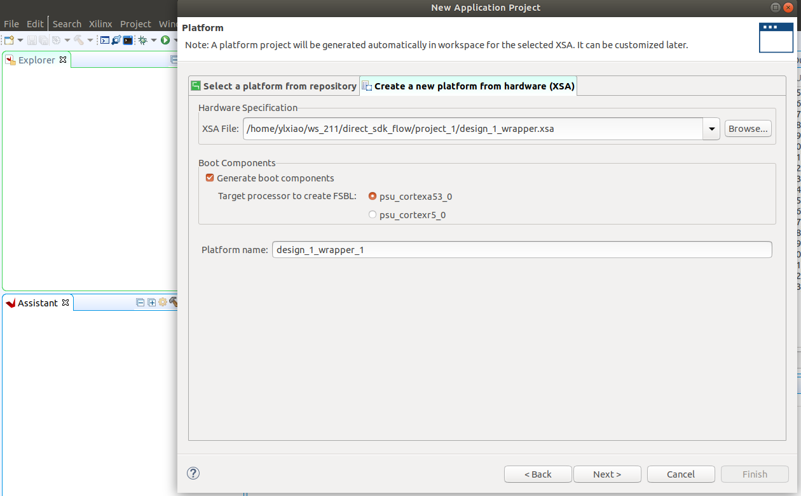

# direct_sdk_flow
This demo is to show how to use standalone platform from Vivado to create Vitis project with [DFX](https://www.xilinx.com/content/dam/xilinx/support/documents/sw_manuals/xilinx2021_2/ug909-vivado-partial-reconfiguration.pdf) features.


## Tutorial 
1. set up the environment variables for the Vitis Tool on you local machine by launching:
```
source /scratch/unsafe/Xilinx/Vitis/2021.1/settings64.sh
```
2. execute `make all` as below. The Makefile will autmatically: 1) create `project/overlay.dcp`; 2) create 'design_1_wrapper.xsa' platform; 3) create an abstract shell (`dfx_abs.dcp`) for one DFX region; 4) implement another logic version for DFX region.

```
make all
```

3. Now we need to create a standalone project in Vitis. Open Xilinx Vitis and create an application project. When choosing the platform, you need choose `project/design_1_wrapper.xsa' as the platform




